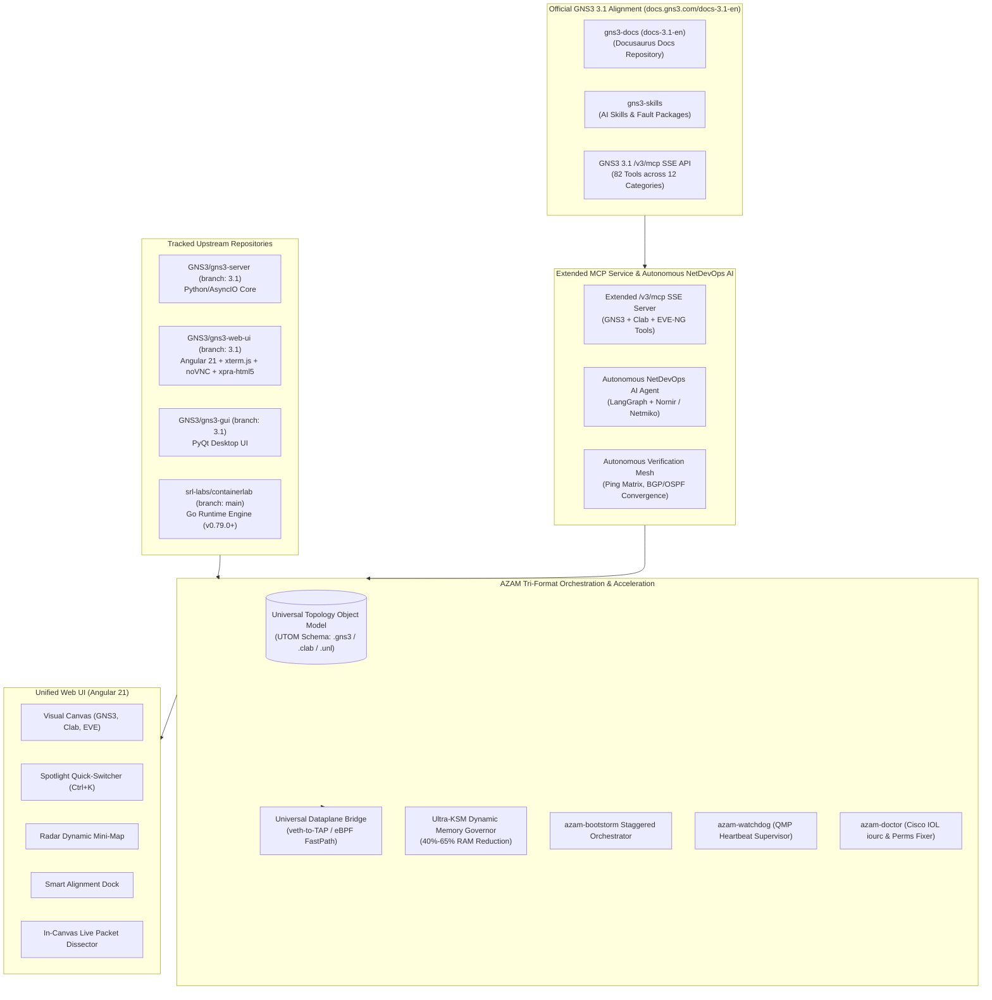
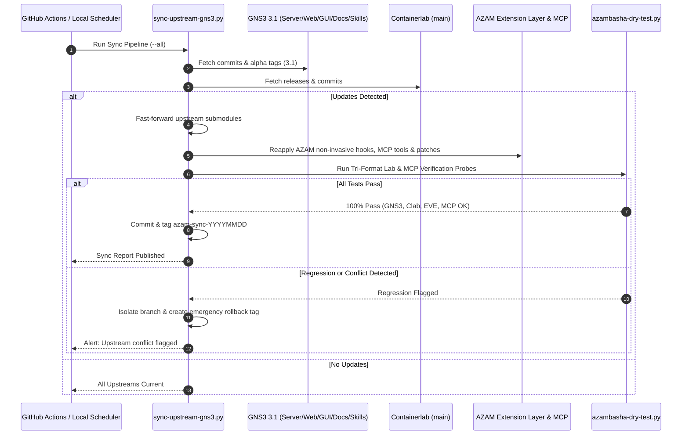
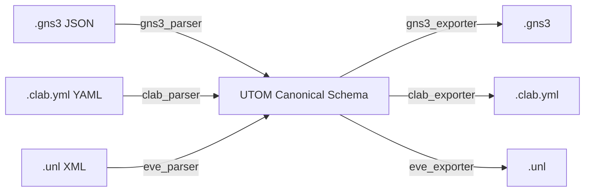
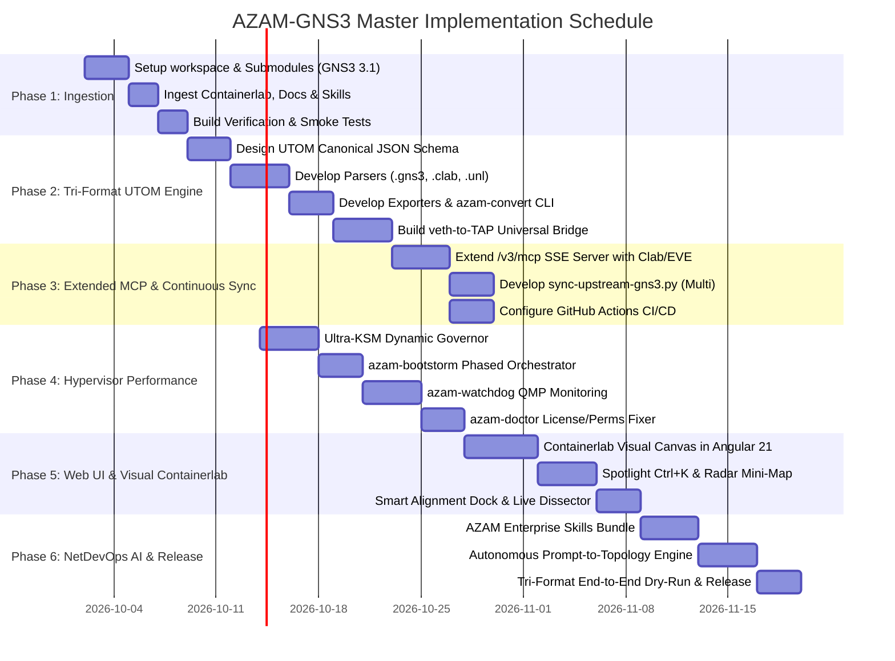

# AZAM-GNS3: Master Implementation & Evolution Plan
## Next-Gen Tri-Format Network Emulation Platform
*(GNS3 3.1 + Containerlab + EVE-NG / PNETLab Unified Architecture)*

---

## Executive Summary

**AZAM-GNS3** is an enterprise-grade virtual network emulation platform that synthesizes the upcoming, next-generation **GNS3 3.1** architecture (as specified in the official [GNS3 3.1 Documentation](https://docs.gns3.com/docs-3.1-en)) with the container-native power of **Containerlab** (`srl-labs/containerlab`) and complete bidirectional compatibility with **EVE-NG / PNETLab** topologies.

This architecture creates a **Universal Tri-Format Network Emulator** that:
1. **Natively Runs & Interconnects Three Lab Ecosystems**:
   - **GNS3 Projects** (`.gns3` JSON project schemas)
   - **Containerlab Topologies** (`.clab.yml` / `.clab.yaml` containerized network schemas)
   - **EVE-NG / PNETLab Labs** (`.unl` XML node and network schemas)
2. **Extends the Official GNS3 3.1 MCP Service (`/v3/mcp`)**: Natively integrates with GNS3 3.1's 82 Model Context Protocol tools and injects dedicated Containerlab, EVE-NG, and hypervisor governance MCP tools so external AI agents (Antigravity IDE, Claude Code, Cursor) can orchestrate any lab format.
3. **Unifies Dataplanes with Zero-Friction Interconnect**: Bridges Containerlab `veth` network namespaces directly into GNS3/EVE-NG QEMU/KVM TAP interfaces and Cisco IOL sockets via kernel fast-path bridging.
4. **Delivers Carrier-Grade Hypervisor Density & Ergonomics**: Leverages AzamLabs' proven Ultra-KSM memory deduplication (60% RAM savings), Anti-Bootstorm phased startup, QMP node watchdog, Radar Mini-Map, Spotlight Quick-Switcher (`Ctrl+K`), and live in-browser packet dissection.

---

## 1. Architectural Blueprint & Subsystem Ecosystem



---

## 2. Incorporating Official GNS3 3.1 Architectural Innovations

Insights extracted from the official documentation ([docs.gns3.com/docs-3.1-en](https://docs.gns3.com/docs-3.1-en)) integrated into AZAM-GNS3:

### 2.1 Native MCP Service (`/v3/mcp`) & Tri-Format Tool Extensions
GNS3 3.1 introduces a standardized Model Context Protocol (MCP) server over SSE (Server-Sent Events) at `/v3/mcp/transport/sse` with 82 native tools spanning:
- **Project Operations** (`project_list`, `project_create`, `project_open`, `project_lock`, etc.)
- **Node Operations** (`node_list`, `node_create`, `node_start`, `node_stop`, `node_console_url`, etc.)
- **Link Operations** (`link_list`, `link_create`, `link_delete`, `link_capture_start`, etc.)
- **Templates, Computes, and User Management**

**AZAM-GNS3 Enhancement**:
Rather than implementing an isolated, non-standard AI API, AZAM-GNS3 **natively extends the official GNS3 3.1 `/v3/mcp` service**, adding custom tool categories:
- **Containerlab Tools**: `clab_deploy`, `clab_destroy`, `clab_inspect`, `clab_node_exec`
- **EVE-NG / PNETLab Tools**: `unl_import`, `unl_export`, `unl_validate`, `unl_to_clab`
- **Universal Converter Tools**: `convert_lab(format, src_path, dst_path)`
- **Hypervisor Density Tools**: `ksm_optimize`, `bootstorm_deploy`, `watchdog_status`, `iol_keygen`
- **Autonomous Verification Mesh**: `verify_ping_mesh`, `verify_bgp_states`, `verify_ospf_neighbors`

This allows tools like **Antigravity IDE**, **Claude Code**, or any MCP-compatible agent to command GNS3, Containerlab, and EVE-NG topologies through a single unified interface.

### 2.2 Official AI Skills Repository Integration (`gns3-skills`)
- GNS3 3.1 maintains an external skill package repository at [gns3/gns3-skills](https://github.com/gns3/gns3-skills).
- The AI assistant uses **LangChain / LangGraph** for reasoning and **Nornir / Netmiko** for device configuration and fault injection.
- **AZAM-GNS3 Integration**:
  - We track `gns3/gns3-skills` as a submodule (`upstream/gns3-skills`).
  - We contribute an **AZAM Enterprise Skills Bundle**:
    - `skill-bgp-evpn-vxlan`: Automated leaf-spine fabric provisioning and state validation.
    - `skill-tri-format-migration`: Autonomous conversion of complex EVE-NG `.unl` labs to Containerlab `.clab.yml`.
    - `skill-dataplane-bench`: Soft-RoCE, jumbo frame (MTU 9000), and link throughput validation.
    - `skill-density-governor`: Ultra-KSM deduplication profiling for large topologies.

### 2.3 Web Operations Alignment: Console, VNC, and Wireshark
- **Web Console**: Powered by `xterm.js`, supporting multi-tabs and drag-and-drop. In AZAM-GNS3, Containerlab container shells (`docker exec`) and Cisco IOL/QEMU serial terminals open seamlessly in the same `xterm.js` interface.
- **Web VNC**: Powered by `noVNC` for graphical desktop VMs (Ubuntu Desktop, Windows guest).
- **Web Wireshark & In-Canvas Dissector**:
  - Upstream streams full X11 Wireshark into the browser via `xpra-html5`.
  - AZAM-GNS3 retains upstream `xpra-html5` Web-Wireshark AND incorporates AzamLabs' lightweight **In-Canvas Live Packet Dissector** for immediate inline packet decode directly beneath the selected link without opening heavy X11 windows.

### 2.4 Official Documentation Synchronization
- The documentation repository [mother/gns3-docs](https://github.com/mother/gns3-docs) will be tracked as a submodule (`upstream/gns3-docs`), enabling automated synchronization of release notes, guide updates, and API reference schemas.

---

## 3. Workspace Layout & Submodule Structure

```
e:/Git/AZAM-GNS3/
├── .github/
│   └── workflows/
│       ├── sync-upstream.yml          # Automated multi-upstream sync (GNS3 + Clab + Docs)
│       └── regression-tests.yml       # Tri-format & MCP integration CI tests
├── upstream/
│   ├── gns3-server/                   # Tracked upstream GNS3 3.1 server (branch: 3.1)
│   ├── gns3-web-ui/                   # Tracked upstream GNS3 3.1 web-ui (branch: 3.1)
│   ├── gns3-gui/                      # Tracked upstream GNS3 3.1 desktop client (branch: 3.1)
│   ├── gns3-docs/                     # Tracked upstream GNS3 3.1 documentation (master)
│   ├── gns3-skills/                   # Tracked upstream GNS3 AI skills repository (master)
│   └── containerlab/                  # Tracked upstream Containerlab Go repo (v0.79.0+)
├── azam-core/                         # AZAM Hypervisor, Dataplane & Density Engine
│   ├── orchestrator/                  # Hybrid execution planner (KVM + Clab + IOL)
│   ├── ksm/                           # Ultra-KSM dynamic memory deduplication governor
│   ├── bootstorm/                     # azam-bootstorm staged startup orchestrator
│   ├── watchdog/                      # azam-watchdog (QMP heartbeat supervisor)
│   ├── dataplane/                     # veth-to-TAP / eBPF kernel fast-path bridge
│   └── doctor/                        # License keygen (IOL iourc) & Docker permission auto-fix
├── azam-formats/                      # Universal Topology Object Model (UTOM)
│   ├── utom.py                        # Core normalized canonical topology schema
│   ├── parsers/                       # Format readers
│   │   ├── gns3_parser.py             # .gns3 JSON reader
│   │   ├── clab_parser.py             # .clab.yml YAML reader
│   │   └── eve_parser.py              # .unl XML reader
│   └── exporters/                     # Format generators
│       ├── gns3_exporter.py           # .gns3 JSON generator
│       ├── clab_exporter.py           # .clab.yml YAML generator
│       └── eve_exporter.py            # .unl XML generator
├── azam-mcp/                          # Extended Model Context Protocol Services
│   ├── mcp_server.py                  # Extends /v3/mcp with Containerlab & EVE-NG tools
│   ├── tools_clab.py                  # Containerlab MCP tool implementations
│   ├── tools_eve.py                   # EVE-NG MCP tool implementations
│   └── tools_governor.py              # Ultra-KSM and Bootstorm MCP tool implementations
├── azam-web/                          # Web UI Enhancements (Angular 21)
│   ├── clab-visualizer/               # Visual canvas rendering for Containerlab
│   ├── spotlight/                     # Spotlight Quick-Switcher (Ctrl+K)
│   ├── radar-minimap/                 # Dynamic floating canvas mini-map
│   ├── smart-alignment/               # Precision alignment & layout dock
│   └── dissector/                     # In-canvas live packet dissector
├── azam-ai/                           # Autonomous NetDevOps AI Engine
│   ├── skills/                        # AZAM Enterprise Skills (BGP, EVPN, Ultra-KSM)
│   ├── architect/                     # Prompt-to-Topology (generates .clab, .gns3, .unl)
│   ├── config-synth/                  # Multi-vendor configuration synthesizer
│   └── verifier/                      # Automated ping mesh & routing state auditor
├── patches/                           # Clean upstream patches (GNS3 + Containerlab)
├── scripts/
│   ├── sync-upstream-gns3.py          # Unified multi-upstream sync engine
│   ├── sync-upstream.ps1              # PowerShell wrapper for automated sync
│   ├── azam-convert.py                # CLI lab converter (.unl <-> .clab <-> .gns3)
│   ├── azam-doctor.py                 # Hypervisor, appliance & license diagnostic tool
│   └── azambasha-dry-test.py          # Tri-format verification probe test suite
├── docs/
│   ├── ARCHITECTURE.md                # System engineering & interconnect specs
│   ├── TRI_FORMAT_LAB_SPEC.md         # UTOM specification & mapping rules
│   ├── MCP_SERVICES_GUIDE.md          # Guide to AZAM-GNS3 Extended MCP Tools
│   ├── SYNC_RUNBOOK.md                # Multi-upstream synchronization runbook
│   └── SUPERIORITY_MATRIX.md          # AZAM-GNS3 vs GNS3 3.1 vs Containerlab vs EVE-NG
└── IMPLEMENTATION_PLAN.md             # This comprehensive master plan
```

---

## 4. Step 1: Upstream Acquisition & Baseline Ingestion

### 4.1 Ingestion Tasks
1. **Initialize Multi-Upstream Submodules**:
   - `upstream/gns3-server` (`https://github.com/GNS3/gns3-server.git`, branch `3.1`)
   - `upstream/gns3-web-ui` (`https://github.com/GNS3/gns3-web-ui.git`, branch `3.1`)
   - `upstream/gns3-gui` (`https://github.com/GNS3/gns3-gui.git`, branch `3.1`)
   - `upstream/gns3-docs` (`https://github.com/mother/gns3-docs.git`, branch `master`)
   - `upstream/gns3-skills` (`https://github.com/gns3/gns3-skills.git`, branch `master`)
   - `upstream/containerlab` (`https://github.com/srl-labs/containerlab.git`, branch `main`)
2. **Establish Baseline Pinned Tags**:
   - GNS3 3.1 snapshot: `azam-gns3-3.1-base`
   - Containerlab snapshot: `azam-clab-base`
3. **Verify Build Pipelines**:
   - Python 3.12+ async / aiohttp environment for GNS3 server.
   - Go 1.23+ build environment for Containerlab CLI binary compilation.
   - Node.js / Angular 21 build for Web UI with xterm.js and xpra-html5 dependencies.

---

## 5. Step 2: Continuous Automated Synchronization Engine

AZAM-GNS3 maintains synchronized parity with rapid upstream alpha updates across GNS3 3.1, official documentation, AI skills, and Containerlab releases.



### 5.1 Automated Sync CLI (`scripts/sync-upstream-gns3.py`)
- `--check-only`: Scans all upstreams for new commits and tags without modifying working directories.
- `--component [server|web-ui|gui|docs|skills|clab|all]`: Targeted component updates.
- `--dry-run`: Merges and compiles in an isolated temporary worktree to verify build sanity.
- `--apply`: Updates submodules, compiles binaries, applies non-invasive overlays, and validates endpoints.
- `--rollback`: Reverts instantly to the last verified pre-sync tag (`azam-pre-sync-*`).

---

## 6. Step 3: Tri-Format Compatibility & Cross-Platform Superiority

### 6.1 The Universal Topology Object Model (UTOM)

AZAM-GNS3 breaks down platform silos by normalizing network designs into **UTOM**:



#### Supported Lab Capabilities Across Formats:
1. **GNS3 Labs (`.gns3`)**:
   - Opens existing GNS3 project files directly.
   - Provisions QEMU/KVM nodes, Dynamips, IOL, and generic switches.
2. **Containerlab Labs (`.clab.yml`)**:
   - Reads standard Containerlab topologies without modification.
   - Launches Nokia SR Linux, Arista cEOS, Cisco XRd, FRR, and Linux containers via the embedded Containerlab Go daemon.
   - **Visualized in Angular 21 Web Canvas**: Renders Containerlab topologies graphically with interactive link drawing, drag-and-drop node placement, click-to-console (`xterm.js`), and live packet capture!
3. **EVE-NG / PNETLab Labs (`.unl`)**:
   - Reads EVE-NG XML `.unl` topology files directly.
   - Automatically maps EVE node templates (`qemu:iol`, `qemu:csr1000v`, `qemu:xrv9k`, `iol:iols`) into AZAM-GNS3 equivalent appliances.
   - Imports startup configurations saved within `<startup_config>` XML blocks.

### 6.2 Universal Dataplane Bridge: Uniting Containers and Heavy VMs
- **veth-to-TAP Interconnect**: Dynamically binds a Containerlab container's `veth` interface directly to a GNS3/EVE QEMU TAP interface or uBridge socket.
- **Direct BGP/OSPF Peering**: A containerized Nokia SR Linux or Arista cEOS router running under Containerlab peers directly across a zero-latency virtual wire with a Cisco IOS-XE QEMU VM or Cisco IOL switch.

---

## 7. Pinnacle Platform Innovations: Comparison Matrix

| Feature Dimension | Stock GNS3 3.1 | Containerlab Alone | EVE-NG / PNETLab | AZAM-GNS3 (Our Platform) |
|---|---|---|---|---|
| **Multi-Format Support** | ❌ GNS3 only | ❌ Clab only | ⚠️ UNL only | ✅ **All 3: GNS3, Clab, EVE-NG** |
| **Containerlab Web UI** | ❌ None | ❌ CLI-only (static graph) | ⚠️ Rudimentary | ✅ **Full Visual Canvas, Drag & Drop** |
| **KVM + Container Mixing**| ⚠️ Primitive Docker | ⚠️ Experimental KVM | ⚠️ High RAM footprint | ✅ **Seamless veth-to-TAP Interconnect**|
| **MCP Service (`/v3/mcp`)**| ⚠️ GNS3 tools only | ❌ None | ❌ None | ✅ **Unified MCP: GNS3 + Clab + EVE** |
| **AI Skills Framework** | ⚠️ gns3-skills (basic)| ❌ None | ❌ None | ✅ **gns3-skills + AZAM Enterprise Skills**|
| **Memory Optimization** | ❌ None | ✅ Low (containers only) | ⚠️ Static KSM | ✅ **Ultra-KSM Dynamic Governor (60% RAM save)** |
| **Boot Storm Protection** | ❌ None | ❌ Rapid launch | ❌ Manual delay | ✅ **`azam-bootstorm` Dependency Pacing** |
| **Silent Freeze Healing** | ❌ None | ❌ Container restart only | ❌ None | ✅ **`azam-watchdog` with QMP Heartbeats** |
| **License Governance** | ❌ Manual Cisco `iourc`| N/A | ⚠️ Manual iourc | ✅ **`azam-doctor` Instant Auto-Keygen** |
| **Docker Root Bug (#2764)**| ❌ Fails to delete | N/A | ⚠️ Manual chmod | ✅ **Integrated Auto-Chmod Remediation** |
| **Canvas Mini-Map** | ❌ None | ❌ None | ❌ None | ✅ **Radar Dynamic Canvas Mini-Map** |
| **Quick Switcher** | ❌ None | ❌ None | ❌ None | ✅ **Spotlight Command Palette (Ctrl+K)** |
| **Alignment Tools** | ⚠️ Basic grid | ❌ None | ⚠️ Basic grid | ✅ **Smart Alignment & Radial Dock** |
| **Packet Dissection** | ⚠️ X11 Xpra window only| ❌ CLI tcpdump / external | ⚠️ External Wireshark | ✅ **Both: Xpra Wireshark + In-Canvas Dissector** |
| **Git Lab Versioning** | ❌ None | ⚠️ Git (user-managed) | ❌ None | ✅ **`azam-topology-git` Automatic VCS** |
| **Autonomous NetDevOps AI**| ⚠️ Basic chat assistant| ❌ None | ❌ None | ✅ **Autonomous Architect, Config Synth & Probes** |

---

## 8. Detailed Execution Roadmap (Phased Milestones)



### Phase 1: Ingestion of GNS3 3.1, Containerlab & Ecosystem (Week 1)
- [ ] Initialize repository structure inside `e:\Git\AZAM-GNS3`.
- [ ] Add submodules:
  - `upstream/gns3-server` (`https://github.com/GNS3/gns3-server.git`, branch `3.1`)
  - `upstream/gns3-web-ui` (`https://github.com/GNS3/gns3-web-ui.git`, branch `3.1`)
  - `upstream/gns3-gui` (`https://github.com/GNS3/gns3-gui.git`, branch `3.1`)
  - `upstream/gns3-docs` (`https://github.com/mother/gns3-docs.git`, branch `master`)
  - `upstream/gns3-skills` (`https://github.com/gns3/gns3-skills.git`, branch `master`)
  - `upstream/containerlab` (`https://github.com/srl-labs/containerlab.git`, branch `main`)
- [ ] Establish baseline release tags (`azam-gns3-3.1-base` and `azam-clab-base`).
- [ ] Verify Go build pipeline for Containerlab and Python 3.12+ async environment for GNS3 server.

### Phase 2: Universal Topology Object Model (UTOM) & Dataplane Bridge (Week 2)
- [ ] Implement `azam-formats/utom.py`: Canonical topology representation.
- [ ] Implement `azam-formats/parsers/`:
  - `gns3_parser.py`: Ingests `.gns3` project JSON.
  - `clab_parser.py`: Ingests `.clab.yml` / `.clab.yaml` topologies.
  - `eve_parser.py`: Ingests EVE-NG / PNETLab `.unl` XML files.
- [ ] Implement `azam-formats/exporters/`: Bi-directional export to any of the 3 formats.
- [ ] Build `scripts/azam-convert.py` CLI utility.
- [ ] Implement `azam-core/dataplane/`: Kernel fastpath and `veth-to-TAP` bridge adapter linking Containerlab nodes with QEMU/IOL nodes.

### Phase 3: Extended MCP Services & Continuous Sync Pipeline (Week 3)
- [ ] Implement `azam-mcp/`: Extends GNS3 3.1's `/v3/mcp/transport/sse` with Containerlab (`clab_*`), EVE-NG (`unl_*`), and hypervisor governance tools.
- [ ] Develop `scripts/sync-upstream-gns3.py` supporting GNS3 3.1 alpha tags, Containerlab GitHub releases, and gns3-docs.
- [ ] Configure GitHub Actions workflow `.github/workflows/sync-upstream.yml` for automated tracking.
- [ ] Build automated regression validation suite `scripts/azambasha-dry-test.py` covering all three lab formats and MCP tool invocations.

### Phase 4: High-Density Hypervisor Performance & Governance (Week 4)
- [ ] Port `azam-core/ksm/`: Ultra-KSM memory deduplication governor (40%–65% RAM reduction).
- [ ] Implement `azam-core/bootstorm/`: Staggered boot orchestrator with CPU throttle gating.
- [ ] Implement `azam-core/watchdog/`: Background QMP supervisor for silent VM lockups.
- [ ] Implement `azam-core/doctor/`: Automatic Cisco IOL `iourc` key generation and Docker root-permission cleanup.

### Phase 5: Web UI Canvas & Visual Containerlab Integration (Week 5)
- [ ] Implement `azam-web/clab-visualizer/`: Visual canvas support for Containerlab topologies in Angular 21.
- [ ] Integrate `azam-web/spotlight/`: Spotlight Quick-Switcher (`Ctrl+K`).
- [ ] Integrate `azam-web/radar-minimap/`: Dynamic floating canvas navigator.
- [ ] Integrate `azam-web/smart-alignment/`: Alignment, radial layout, and link routing dock.
- [ ] Integrate `azam-web/dissector/`: In-browser packet dissector alongside Web-Wireshark.
- [ ] Integrate `azam-topology-git`: Git-backed automatic topology micro-commit and rollback.

### Phase 6: Autonomous NetDevOps AI Engine & Turnkey Launch (Week 6)
- [ ] Implement `azam-ai/skills/`: AZAM enterprise skills for leaf-spine BGP EVPN and chaos testing.
- [ ] Implement `azam-ai/architect/`: Natural language to Tri-Format lab generator (outputs `.clab.yml`, `.gns3`, or `.unl`).
- [ ] Implement `azam-ai/config-synth/`: Multi-vendor configuration generator (Cisco, Arista, Nokia, Juniper, Linux).
- [ ] Implement `azam-ai/verifier/`: Automated ping mesh and BGP/OSPF convergence auditor.
- [ ] Build turnkey deployment orchestrator `scripts/azam-deploy.py` (Linux bare-metal, Docker Compose, Windows WSL2).
- [ ] Execute full tri-format validation dry-run.

---

## 9. Operational CLI Commands for AZAM-GNS3

### 9.1 Multi-Upstream Sync Probes
```bash
# Check upstream status for GNS3 3.1, Containerlab, and Docs:
python scripts/sync-upstream-gns3.py --check-only

# Perform dry-run merge in isolated worktree:
python scripts/sync-upstream-gns3.py --dry-run

# Synchronize all components:
python scripts/sync-upstream-gns3.py --apply --all

# Emergency rollback to last known-good pre-sync tag:
python scripts/sync-upstream-gns3.py --rollback
```

### 9.2 Tri-Format Lab Converter Probes
```bash
# Convert an EVE-NG / PNETLab lab to Containerlab:
python scripts/azam-convert.py --input mylab.unl --output mylab.clab.yml

# Convert a Containerlab topology to GNS3 3.1 project:
python scripts/azam-convert.py --input mylab.clab.yml --output mylab.gns3

# Convert a GNS3 project to EVE-NG XML:
python scripts/azam-convert.py --input mylab.gns3 --output mylab.unl

# Validate lab syntax across all 3 formats:
python scripts/azam-convert.py --validate mylab.unl
```

### 9.3 Launch & Deployment Probes
```bash
# Launch a hybrid lab running QEMU VMs and Containerlab containers:
python scripts/azam-deploy.py --run-lab mylab.clab.yml --enable-kvm-bridge

# Run full health audit, KSM memory check, and IOL license verification:
python scripts/azam-doctor.py --audit

# Execute automated tri-format regression dry-run test:
python scripts/azambasha-dry-test.py --tri-format-test
```

---

## 10. Next Steps

1. **Phase 1 Execution**: Pull and initialize the 6 upstream submodules (`gns3-server`, `gns3-web-ui`, `gns3-gui`, `gns3-docs`, `gns3-skills`, `containerlab`).
2. **Build the UTOM Core**: Scaffold `azam-formats/` with `.unl`, `.clab.yml`, and `.gns3` parser engines.
3. **Deploy Synchronization Engine**: Implement `scripts/sync-upstream-gns3.py` to continuously track GNS3 3.1 alpha commits, Containerlab releases, and documentation updates.
