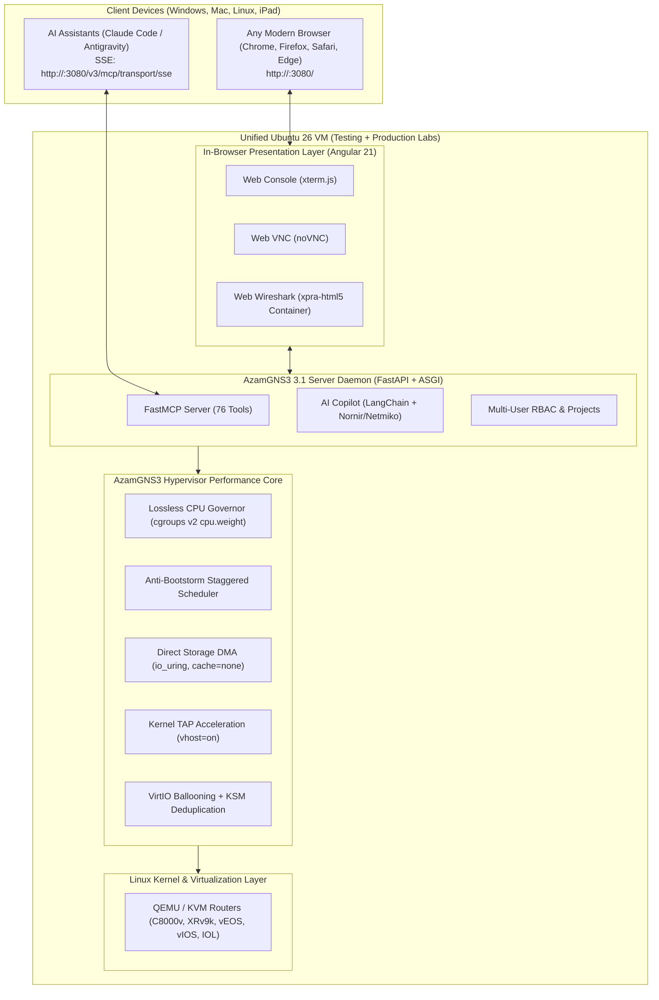

# Installation & Deployment Guide: AzamGNS3 3.1 Enterprise Edition

## 1. Unified Single-VM Architecture (Testing & Production)

AzamGNS3 runs as a **single, unified server daemon** on one dedicated Ubuntu 26 (or 24.04 LTS) VM. You **do not need multiple environments or separate staging servers** — this single VM hosts both your development testing and massive production labs:



---

## 2. Core Capabilities

* **100% Browser-Based (EVE-NG / PNETLab Style)**:
  * **Zero Client Software**: No GNS3 GUI, PuTTY, or Wireshark desktop installations required.
  * **In-Browser Web Consoles**: Direct `xterm.js` terminals with multi-tabs and drag-and-drop.
  * **In-Browser Web VNC**: Native HTML5 `noVNC` for graphical desktop virtual machines.
  * **In-Browser Web Wireshark**: Live packet dissection directly on the topology canvas via containerized `xpra-html5`.
* **AzamGNS3 Hypervisor Performance Core**:
  * **Lossless Dynamic CPU Governor**: Cgroups v2 `cpu.weight` dynamic scheduling (10–1000) with 5-second hysteresis. Replaces legacy `cpulimit` process pausing to eliminate keepalive drops and BGP/OSPF flapping.
  * **Anti-Bootstorm Scheduler**: Tiered, load-aware staggered node startup preventing 100% CPU lockups during batch launches.
  * **Direct I/O DMA (`io_uring`) & Kernel TAP (`vhost=on`)**: High-throughput storage and network data paths.
  * **VirtIO Memory Ballooning & Host KSM**: Dynamically reclaims and deduplicates identical RAM pages across router images for 3x–4x higher node density.
* **First-Class AI & Model Context Protocol (MCP)**:
  * Built-in FastMCP server mounting **76 AI tools** over Server-Sent Events (`/v3/mcp/transport/sse`).
  * AI Copilot engine with multi-threaded router console automation via **Nornir + Netmiko**.

---

## 3. 1-Click Automated Installation on Ubuntu 26 (Recommended)

Run the automated installer on your single Ubuntu VM as root:

```bash
git clone https://github.com/azambasha1987/MyRepo.git
cd MyRepo/scripts/ubuntu26
sudo chmod +x install.sh azamgns3-system-tune.sh
sudo ./install.sh
```

### What this automated command does:
1. Installs all virtualization packages (`qemu-system-x86`, `bridge-utils`, `libvirt`, `docker.io`, `mtools`, `socat`).
2. Applies kernel tuning (KSM Smart-Scan, MGLRU, ZRAM zstd compression, and sysctl buffers).
3. Creates user `azam` with membership in `kvm`, `libvirt`, and `docker`.
4. Creates the Python 3.14 virtual environment in `/opt/azamgns3/venv`.
5. Installs the full 3.1 server with FastMCP, AI Copilot, and our performance engines.
6. Installs, enables, and launches the systemd daemon `azamgns3.service`.

---

## 4. Service Verification & Management

Check that the server daemon is running:
```bash
sudo systemctl status azamgns3
```

Inspect real-time server logs:
```bash
sudo journalctl -u azamgns3 -f
```

Restart the service:
```bash
sudo systemctl restart azamgns3
```

---

## 5. Accessing the Web Studio

Once the server is running on your VM:
1. Open any browser (Chrome, Firefox, Safari, Edge) on your client machine.
2. Navigate to:
   ```text
   http://<VM-IP-ADDRESS>:3080/
   ```
3. You will immediately access the **Angular 21 Web Studio**:
   * Click **New Project** to start building.
   * Drag and drop nodes onto the canvas.
   * Click any node to open its **in-browser HTML5 xterm.js console**.
   * Right-click any link to start live **in-browser Web Wireshark** packet captures.

---

## 6. Connecting External AI Assistants (Claude Code / Antigravity)

AzamGNS3 3.1 exposes its Model Context Protocol (MCP) server over SSE.

### Step 1: Create an API Key
In the Web Studio at `http://<VM-IP-ADDRESS>:3080/`:
1. Click the top-right menu $(\dots) \rightarrow$ **API Keys**.
2. Click **Create API Key** and copy your generated key (`gns3_...`).

### Step 2: Register with Your AI Client (e.g. Claude Code)
```bash
claude mcp add --transport sse AzamGNS3 \
  http://<VM-IP-ADDRESS>:3080/v3/mcp/transport/sse \
  -H "Authorization: Bearer <YOUR_API_KEY>"
```

Once connected, your AI assistant can build, wire, configure, and troubleshoot labs directly via natural language!
