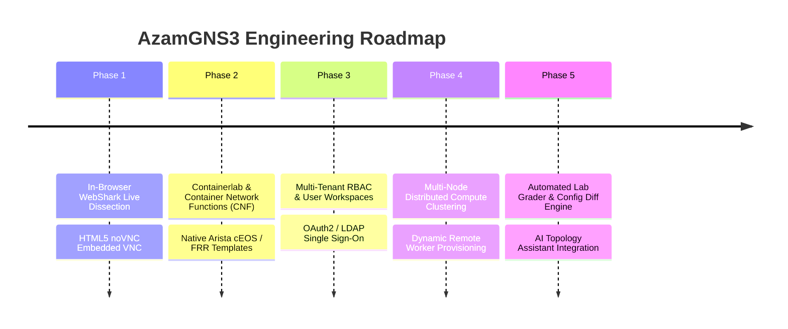

# 05. Future Roadmap & Extensibility Guide

This document outlines the strategic engineering roadmap and extensibility plans for AzamGNS3.

---

## 1. Feature Roadmap Overview

---

## 2. Detailed Workstreams

### Phase 1: In-Browser Packet Analysis & Graphical VNC
- **WebShark Integration**:
  - Integrate Wireshark's native `sharkd` daemon on Ubuntu 26 with an embedded WebShark HTML5 frontend.
  - Allows engineers to right-click any link on the web canvas and inspect live protocol dissections directly in the browser, completely removing the need to stream PCAP files to an external desktop Wireshark app.
- **Embedded noVNC for Desktop Nodes**:
  - Add WebSocket-to-VNC proxying for nodes with `console_type=vnc` (e.g. Windows, Ubuntu Desktop, Security Onion).
  - Open graphical desktop consoles in docked split tabs alongside the terminal.

### Phase 2: Ultra-Lightweight Container Network Functions (CNF)
- **Containerlab & Docker Topology Presets**:
  - Build one-click templates for lightweight network container images:
    - **FRRouting (FRR)**: 45MB RAM, boots in <1 second (BGP, OSPF, IS-IS, Segment Routing).
    - **Arista cEOS**: Containerized EOS running in ~350MB RAM instead of 2.5GB for vEOS VM.
    - **Alpine Linux Network Nodes**: 20MB RAM utility routers.
  - Enables massive 50+ node topologies on modest hardware (16GB RAM).

### Phase 3: Multi-Tenant RBAC & Authentication
- **User Management & Role-Based Access Control**:
  - Implement tenant isolation, allowing multiple students or network engineers to build independent labs on a single shared Ubuntu 26 server.
  - Integrate LDAP, Active Directory, and OAuth2/OpenID Connect (OIDC) Single Sign-On.
  - Project sharing with read-only and collaborator permissions.

### Phase 4: Multi-Node Distributed Compute Clustering
- **Horizontal Worker Scaling**:
  - Distribute heavy QEMU virtual machines across multiple Ubuntu 26 worker compute nodes.
  - Automated cluster capacity balancing based on real-time CPU, RAM, and KSM deduplication metrics (integrating logic from `azambasha-cluster-capacity.py`).
  - Cross-node inter-VM VXLAN / GRE encapsulation for transparent multi-chassis links.

### Phase 5: Automated Lab Grader & AI Copilot Integration
- **Automated Verification & Grading**:
  - Port `azambasha-lab-grader.py` to allow instructors to define automated pass/fail criteria (routing table convergence, ping mesh reachability, BGP state verification).
- **Topology Config Diffing & Git Sync**:
  - Port `azambasha-topology-git.py` to allow 1-click snapshotting of running router configs directly into Git repositories.
- **AI Topology Copilot**:
  - In-browser AI assistant capable of suggesting interface IP schemes, generating initial device configs, and troubleshooting link errors.
