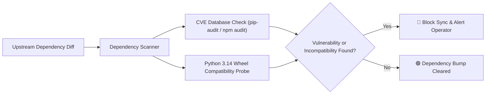

# SDLC-Integrated Upstream Update Check & Governance Plan (AzamGNS3)

*Scan Platform: Ubuntu 26.04 (Resolute) / Windows 11* | *Repository: azambasha1987/MyRepo (AzamGNS3)*

---

## 1. Executive Framework: SDLC-Wide Governance
This plan establishes an enterprise-grade **Software Development Life Cycle (SDLC)** governance framework for AzamGNS3. It ensures that official upstream commits from [`gns3-server`](https://github.com/GNS3/gns3-server), [`gns3-gui`](https://github.com/GNS3/gns3-gui), and [`gns3-web-ui`](https://github.com/GNS3/gns3-web-ui) are continuously monitored, audited, and adapted throughout all phases of development, testing, release, and production without regressions.

```mermaid
flowchart TD
    subgraph SDLC1 [Stage 1: Threat & Ingestion Radar]
        R1["Multi-Track Scanner: Stable Tags vs. Maintenance vs. Master"]
        R2["Upstream Git Drift Detection (Commits Ahead)"]
        R3["Dependency Supply Chain & CVE Vulnerability Radar"]
    end

    subgraph SDLC2 [Stage 2: Architectural Shielding]
        A1["Function-Level Semantic AST Shield (_disk_interface_options, start_all)"]
        A2["REST API Contract & Schema Drift Gate (schemas/ validation)"]
        A3["Risk Classifier (🟢 SAFE vs 🟡 ADAPT vs 🔴 HAZARD)"]
    end

    subgraph SDLC3 [Stage 3: Dev & Isolation Sandbox]
        D1["Pre-Commit Hooks (Syntax, AST, & Lint validation)"]
        D2["Automated Isolated Sandbox Branches (sync/audit-TIMESTAMP)"]
    end

    subgraph SDLC4 [Stage 4: CI/CD Pipeline Gates]
        C1["GitHub Actions Workflow (.github/workflows/azamgns3-upstream-sync.yml)"]
        C2["Automated Pipeline Exit Codes (--ci flag: 0=clean, 1=test fail, 2=conflict)"]
        C3["Automated Markdown Artifact Publishing (docs/reports/)"]
    end

    subgraph SDLC5 [Stage 5: Multi-Tier QA Matrix]
        Q1["Unit & Performance Suite (tests/test_optimizations.py)"]
        Q2["Python 3.14 AST Compilation Checks"]
        Q3["Canary Side-by-Side Sandbox Testing (Port 3081)"]
    end

    subgraph SDLC6 [Stage 6: Deployment & Rollback]
        P1["Canary Validation & Operator Approval Gate"]
        P2["Production Deployment (systemctl restart azamgns3)"]
        P3["Immutable Backup Checkpoints & 1-Command Instant Rollback"]
    end

    SDLC1 --> SDLC2 --> SDLC3 --> SDLC4 --> SDLC5 --> SDLC6
```



---

## 2. Mandatory Production Safeguards: The Zero-Glitch Protocol

> [!CAUTION]
> ### NON-REGRESSION DIRECTIVE
> All actions, code reviews, and upstream integrations must strictly follow the **AzamGNS3 Zero-Glitch Protocol**:
> 1. **Zero Disruption to Active Labs & Running Nodes**:
>    - Never execute blanket service restarts or network reloads during active lab execution.
> 2. **Automated Rollback Checkpoints (`.bak.<timestamp>`)**:
>    - Every production file must have an immutable, timestamped backup created prior to mutation, backed by an instant rollback procedure.
> 3. **Preservation of Performance Engines**:
>    - **Lossless CPU Governor (`cpu.weight`)**: Cgroups v2 dynamic scheduling and 5s hysteresis must never be replaced by legacy `cpulimit`.
>    - **Anti-Bootstorm Scheduler**: Weighted node startup tiers and load gating in `project.py` must never be overwritten.
>    - **Direct I/O (`io_uring`) & TAP `vhost=on`**: Asynchronous storage DMA and kernel TAP acceleration in `qemu_vm.py` must remain intact.
>    - **VirtIO Memory Ballooning**: Dynamic RAM reclamation for KSM memory deduplication must be preserved.
> 4. **Pre-Flight Syntax & Sanity Probes**:
>    - Every script is verified with `py_compile`, and all unit tests in `tests/test_optimizations.py` must pass with zero failures before committing.

---

## 3. Core Philosophy: Audited Adaptation vs. Blind Copy-Pasting

> [!IMPORTANT]
> ### WHY WE DO NOT BLINDLY MERGE UPSTREAM COMMITS
> Official upstream GNS3 repositories frequently push commits that:
> - Re-introduce external `cpulimit` (which uses `SIGSTOP`/`SIGCONT` that drops packets and flaps BGP/OSPF).
> - Remove or alter QEMU disk options, wiping `aio=io_uring` and `cache=none`.
> - Omit `-device virtio-balloon-pci`, defeating host KSM deduplication.
> - Introduce Python 3.14 import errors (such as `AttributeError: module aiohttp has no attribute web`).
> - Revert web UI console configurations or force desktop GUI dependencies.
> 
> Therefore, AzamGNS3 operates a **curated, human-in-the-loop intelligence, audit, and adaptation pipeline**:
> 1. **Upstream Drift Radar**: Automatically detect new commits across `gns3-server`, `gns3-gui`, and `gns3-web-ui`.
> 2. **Surgical Code Cross-Audit**: Compare incoming diffs against our protected touchpoints.
> 3. **Audited Adaptation**: Port only safe upstream bug fixes and security patches into AzamGNS3 while keeping our performance core 100% protected.

---

## 4. Multi-Track Upstream Ingestion Radar

To accommodate different enterprise risk tolerances across the SDLC, the update check engine supports three distinct monitoring tracks:

| Ingestion Track | Upstream Ref | Target Environment | Update Cadence | Risk Tolerance |
| :--- | :--- | :--- | :--- | :--- |
| **Track A: Production Stable** | `refs/tags/v2.2.*`, `v3.0.*` | Production Servers | Monthly / Quarterly | **Conservative**: Only certified, packaged release tags. |
| **Track B: Maintenance Patch** | `refs/heads/2.2` | Production / Staging | Bi-weekly | **Moderate**: Targeted hotfixes and backports. |
| **Track C: Bleeding-Edge** | `refs/heads/master` | Staging / Development | Continuous / Weekly | **Agile**: Latest experimental innovations and features. |

*CLI Selector*:
```bash
# Monitor default bleeding-edge master
python scripts/azamgns3-update-checker.py --track master

# Monitor production stable release tags
python scripts/azamgns3-update-checker.py --track stable
```

---

## 5. Function-Level Semantic Shield (Beyond File Matching)

Rather than generating false-positive warnings whenever a large file like `qemu_vm.py` is touched, the update engine performs **AST & Symbol-Level Semantic Diffing**:

```
                                  Upstream Commit Touches qemu_vm.py
                                                  │
                        ┌─────────────────────────┴─────────────────────────┐
                        ▼                                                   ▼
            Touches Unrelated Method                           Touches Protected Method
       (e.g., _cdrom_image_options, _tpm)                 (_disk_interface_options, start, stop)
                        │                                                   │
                        ▼                                                   ▼
                 🟢 SAFE TO ADAPT                                   🔴 COLLISION DETECTED
              (Auto-cherrypick permitted)                         (Requires surgical review)
```

### Symbol Protection Registry

| Protected Method / Symbol | File Location | Critical Feature Protected | Collision Action |
| :--- | :--- | :--- | :--- |
| `QemuVM._disk_interface_options` | `gns3server/compute/qemu/qemu_vm.py` | Direct asynchronous I/O (`cache=none,aio=io_uring,discard=unmap`) | **PROTECTED**: Block overwrite; preserve storage flags. |
| `QemuVM.start` (Process Hook) | `gns3server/compute/qemu/qemu_vm.py` | `CpuGovernor` TAP monitoring launch | **PROTECTED**: Preserve dynamic governor initialization. |
| `QemuVM.stop` (Cleanup Hook) | `gns3server/compute/qemu/qemu_vm.py` | `CpuGovernor` graceful termination | **PROTECTED**: Preserve dynamic governor cleanup. |
| `QemuVM.network_options` (TAP) | `gns3server/compute/qemu/qemu_vm.py` | TAP interface `vhost=on` kernel acceleration | **PROTECTED**: Preserve `vhost=on` flag. |
| `Project.start_all` | `gns3server/controller/project.py` | Load-aware Anti-Bootstorm batch scheduler | **PROTECTED**: Preserve `BootstormEngine.start_nodes_staggered`. |
| `controller/compute.py` (Top) | `gns3server/controller/compute.py` | Python 3.14 `import aiohttp.web` fix | **PROTECTED**: Preserve explicit `aiohttp.web` import. |
| `controller/__init__.py` (Top) | `gns3server/controller/__init__.py` | Python 3.14 `import aiohttp.web` fix | **PROTECTED**: Preserve explicit `aiohttp.web` import. |

---

## 6. Dependency & Supply Chain Security Radar

Upstream commits frequently bump dependencies in `requirements.txt` or `package.json`. The update check engine scrutinizes all third-party changes:



1. **Python Dependency Audit**:
   - Scans diffs in `gns3-server/requirements.txt` and `gns3-server/win-requirements.txt`.
   - Runs `pip-audit` to ensure new packages contain zero known vulnerabilities (CVEs).
2. **Web UI NPM Dependency Audit**:
   - Scans diffs in `gns3-web-ui/package.json`.
   - Validates Angular and xterm.js version compatibility with Node.js LTS.

---

## 7. REST API Contract & Schema Backward Compatibility Gate

To prevent upstream changes from breaking the in-browser Web UI or external API clients:
1. **Schema Diffing**:
   - The engine monitors `gns3-server/gns3server/schemas/`.
   - Flags any removed JSON schema properties, renamed endpoints, or changed payload requirements.
2. **Route Decorator Scan**:
   - Monitors `gns3server/web/route.py` and `gns3server/handlers/` for altered API route signatures.
   - Any modification to `/v2/projects/{project_id}/nodes/{node_id}/console/ws` is flagged with critical priority.

---

## 8. SDLC Operational Guide: The 6 Lifecycle Gateways

### Gateway 1: Ingestion & Drift Radar
```bash
# Standard interactive check with colorized summary
python scripts/azamgns3-update-checker.py

# Machine-readable JSON output for integrations
python scripts/azamgns3-update-checker.py --json

# CI/CD execution (returns exit code 2 on conflicts, 1 on test failures, 0 on clean)
python scripts/azamgns3-update-checker.py --ci
```

### Gateway 2: Automated Sandbox Isolation
```bash
# Automatically creates isolated branch 'sync/audit-TIMESTAMP' across submodules
python scripts/azamgns3-update-checker.py --sandbox
```

### Gateway 3: CI/CD Quality Pipeline (GitHub Actions)
Defined in [`.github/workflows/azamgns3-upstream-sync.yml`](file:///e:/Git/AzamGNS3/.github/workflows/azamgns3-upstream-sync.yml):
- Executes weekly on schedule (`0 2 * * 1`) or upon pull request.
- Runs `--ci` mode and publishes timestamped audit reports into GitHub Actions artifacts.

### Gateway 4: Multi-Tier Pre-Flight Testing
```bash
# 1. Run optimization unit tests
python tests/test_optimizations.py

# 2. Verify Python 3.14 AST compilation
python -m py_compile gns3-server/gns3server/compute/qemu/cpu_governor.py
python -m py_compile gns3-server/gns3server/controller/bootstorm.py
python -m py_compile gns3-server/gns3server/compute/qemu/qemu_vm.py
python -m py_compile gns3-server/gns3server/controller/project.py
```

### Gateway 5: Canary Sandbox Staging & Side-by-Side Verification
Before deploying to production port `3080`, test the candidate build side-by-side on port `3081`:
```bash
# Start temporary canary server instance on port 3081
/opt/azamgns3/venv/bin/gns3server --port 3081 --daemon --log /var/log/azamgns3/canary.log

# Execute canary smoke probe
curl -f -s http://localhost:3081/v2/version || { echo "Canary verification failed!"; exit 1; }

# Terminate canary instance after successful probe
pkill -f "gns3server --port 3081"
```

### Gateway 6: Turnkey Production Deployment & Instant Rollback Runbook

#### Deploying Updates to Production:
```bash
# On Ubuntu 26 server
cd /opt/azamgns3
git pull origin main
git submodule update --init --recursive
sudo systemctl restart azamgns3
```

#### Instant 1-Command Rollback Runbook:
If any unexpected behavioral drift is observed in production:
```bash
# Revert to previous Git commit instantly
git reset --hard HEAD~1
git submodule update --init --recursive
sudo systemctl restart azamgns3
```
Active running lab topologies and nodes remain completely intact due to decoupled QEMU process state.

---

## 9. Emergency Zero-Day Fast-Track Protocol

In the event of a critical upstream security advisory (Zero-Day CVE):
1. **Bypass Weekly Cadence**: Trigger immediate manual scanner execution with `--track master`.
2. **Isolate Security Commit**: Identify the exact security commit hash (`<cve_sha>`).
3. **Cherry-Pick to Sandbox**:
   ```bash
   git checkout -b hotfix/cve-remediation
   git cherry-pick <cve_sha>
   ```
4. **Run Pre-Flight Probes**: Ensure `tests/test_optimizations.py` and `py_compile` pass 100%.
5. **Immediate Hotfix Push**: Merge and deploy to production within a strict 2-hour SLA.
