# SDLC-Integrated Upstream Update Check & Governance Plan (AzamGNS3)

*Scan Platform: Ubuntu 26.04 (Resolute) / Windows 11* | *Repository: azambasha1987/MyRepo (AzamGNS3)*

---

## 1. Executive Framework: SDLC-Wide Governance
This plan establishes an enterprise-grade **Software Development Life Cycle (SDLC)** governance framework for AzamGNS3. It ensures that official upstream commits from [`gns3-server`](https://github.com/GNS3/gns3-server), [`gns3-gui`](https://github.com/GNS3/gns3-gui), and [`gns3-web-ui`](https://github.com/GNS3/gns3-web-ui) are continuously monitored, audited, and adapted throughout all phases of development, testing, release, and production without regressions.

```mermaid
flowchart TD
    subgraph SDLC1 [Stage 1: Threat & Ingestion Radar]
        R1["Weekly Scheduled Scanner (scripts/azamgns3-update-checker.py)"]
        R2["Upstream Git Drift Detection (Commits Ahead)"]
        R3["Dependency CVE & Advisory Checks"]
    end

    subgraph SDLC2 [Stage 2: Architectural Shielding]
        A1["Protected Touchpoints Filter (cpu_governor, bootstorm, io_uring)"]
        A2["Collision & Regression Classification (SAFE vs CAUTION vs CONFLICT)"]
    end

    subgraph SDLC3 [Stage 3: Dev & Isolation Sandbox]
        D1["Pre-Commit Hooks (Syntax & AST checks)"]
        D2["Automated Isolated Sandbox Branches (sync/audit-TIMESTAMP)"]
    end

    subgraph SDLC4 [Stage 4: CI/CD Pipeline Gates]
        C1["GitHub Actions Workflow (.github/workflows/azamgns3-upstream-sync.yml)"]
        C2["Automated Exit Codes (--ci flag: 0=clean, 1=test fail, 2=conflict)"]
        C3["Automated Markdown Artifact Publishing (docs/reports/)"]
    end

    subgraph SDLC5 [Stage 5: Multi-Tier QA Matrix]
        Q1["Unit & Performance Suite (tests/test_optimizations.py)"]
        Q2["Python 3.14 AST Compilation Checks"]
        Q3["TAP vhost-net & QEMU CLI Flags Validation"]
    end

    subgraph SDLC6 [Stage 6: Deployment & Rollback]
        P1["Canary Staging & Human Approval Gate"]
        P2["Production Deployment (systemctl restart azamgns3)"]
        P3["Immutable Backup Checkpoints & 1-Command Instant Rollback"]
    end

    SDLC1 --> SDLC2 --> SDLC3 --> SDLC4 --> SDLC5 --> SDLC6
```



---

## 2. Mandatory Production Safeguards: The Zero-Glitch Protocol

> [!CAUTION]
> ### NON-REGRESSION DIRECTIVE
> All actions, code reviews, and upstream integrations must strictly follow the **AzamGNS3 Zero-Glitch Protocol**:
> 1. **Zero Disruption to Active Labs & Running Nodes**:
>    - Never execute blanket service restarts or network reloads during active lab execution.
> 2. **Automated Rollback Checkpoints (`.bak.<timestamp>`)**:
>    - Every production file must have an immutable, timestamped backup created prior to mutation, backed by an instant rollback procedure.
> 3. **Preservation of Performance Engines**:
>    - **Lossless CPU Governor (`cpu.weight`)**: Cgroups v2 dynamic scheduling and 5s hysteresis must never be replaced by legacy `cpulimit`.
>    - **Anti-Bootstorm Scheduler**: Weighted node startup tiers and load gating in `project.py` must never be overwritten.
>    - **Direct I/O (`io_uring`) & TAP `vhost=on`**: Asynchronous storage DMA and kernel TAP acceleration in `qemu_vm.py` must remain intact.
>    - **VirtIO Memory Ballooning**: Dynamic RAM reclamation for KSM memory deduplication must be preserved.
> 4. **Pre-Flight Syntax & Sanity Probes**:
>    - Every script is verified with `py_compile`, and all unit tests in `tests/test_optimizations.py` must pass with zero failures before committing.

---

## 3. Core Philosophy: Audited Adaptation vs. Blind Copy-Pasting

> [!IMPORTANT]
> ### WHY WE DO NOT BLINDLY MERGE UPSTREAM COMMITS
> Official upstream GNS3 repositories frequently push commits that:
> - Re-introduce external `cpulimit` (which uses `SIGSTOP`/`SIGCONT` that drops packets and flaps BGP/OSPF).
> - Remove or alter QEMU disk options, wiping `aio=io_uring` and `cache=none`.
> - Omit `-device virtio-balloon-pci`, defeating host KSM deduplication.
> - Introduce Python 3.14 import errors (such as `AttributeError: module aiohttp has no attribute web`).
> - Revert web UI console configurations or force desktop GUI dependencies.
> 
> Therefore, AzamGNS3 operates a **curated, human-in-the-loop intelligence, audit, and adaptation pipeline**:
> 1. **Upstream Drift Radar**: Automatically detect new commits across `gns3-server`, `gns3-gui`, and `gns3-web-ui`.
> 2. **Surgical Code Cross-Audit**: Compare incoming diffs against our protected touchpoints.
> 3. **Audited Adaptation**: Port only safe upstream bug fixes and security patches into AzamGNS3 while keeping our performance core 100% protected.

---

## 4. Protected Touchpoints Matrix (AzamGNS3 Shield)

| Protected File | Description | Collision Action |
| :--- | :--- | :--- |
| [`gns3server/compute/qemu/cpu_governor.py`](file:///e:/Git/AzamGNS3/gns3-server/gns3server/compute/qemu/cpu_governor.py) | Cgroups v2 dynamic CFS weight scheduling | **IMMUNE**: Never overwrite with upstream code. |
| [`gns3server/compute/qemu/qemu_vm.py`](file:///e:/Git/AzamGNS3/gns3-server/gns3server/compute/qemu/qemu_vm.py) | Direct `io_uring` I/O, `vhost=on`, `virtio-balloon`, and `CpuGovernor` hooks | **HIGH CAUTION**: Audit line-by-line before adapting. |
| [`gns3server/controller/bootstorm.py`](file:///e:/Git/AzamGNS3/gns3-server/gns3server/controller/bootstorm.py) | Anti-Bootstorm weighted startup engine | **IMMUNE**: Never overwrite with upstream code. |
| [`gns3server/controller/project.py`](file:///e:/Git/AzamGNS3/gns3-server/gns3server/controller/project.py) | `start_all()` hook into `BootstormEngine` | **CAUTION**: Preserve `BootstormEngine.start_nodes_staggered`. |
| [`gns3server/controller/compute.py`](file:///e:/Git/AzamGNS3/gns3-server/gns3server/controller/compute.py) | Python 3.14 explicit `aiohttp.web` import | **CAUTION**: Preserve `import aiohttp.web`. |
| [`gns3server/controller/__init__.py`](file:///e:/Git/AzamGNS3/gns3-server/gns3server/controller/__init__.py) | Python 3.14 explicit `aiohttp.web` import | **CAUTION**: Preserve `import aiohttp.web`. |

---

## 5. SDLC Operational Guide: The 6 Lifecycle Gateways

### Gateway 1: Automated Ingestion & Drift Radar
Run the scanner manually or via cron/task scheduler:
```bash
# Standard interactive check with colorized summary
python scripts/azamgns3-update-checker.py

# Machine-readable JSON output for integrations
python scripts/azamgns3-update-checker.py --json

# CI/CD execution (returns exit code 2 on conflicts, 1 on test failures, 0 on clean)
python scripts/azamgns3-update-checker.py --ci
```

### Gateway 2: Automated Sandbox Isolation
If new commits are available, never work on the production branch directly:
```bash
# Automatically creates isolated branch 'sync/audit-TIMESTAMP' across submodules
python scripts/azamgns3-update-checker.py --sandbox
```

### Gateway 3: CI/CD Quality Pipeline (GitHub Actions)
Defined in [`.github/workflows/azamgns3-upstream-sync.yml`](file:///e:/Git/AzamGNS3/.github/workflows/azamgns3-upstream-sync.yml):
- Executes weekly on schedule (`0 2 * * 1`) or upon pull request.
- Runs `--ci` mode and publishes timestamped audit reports into GitHub Actions artifacts.

### Gateway 4: Multi-Tier Pre-Flight Testing
Before approving any adaptation:
```bash
# 1. Run optimization unit tests
python tests/test_optimizations.py

# 2. Verify Python 3.14 AST compilation
python -m py_compile gns3-server/gns3server/compute/qemu/cpu_governor.py
python -m py_compile gns3-server/gns3server/controller/bootstorm.py
python -m py_compile gns3-server/gns3server/compute/qemu/qemu_vm.py
python -m py_compile gns3-server/gns3server/controller/project.py
```

### Gateway 5: Human-in-the-Loop Approval & Commit
1. Review generated report in [`docs/reports/`](file:///e:/Git/AzamGNS3/docs/reports/).
2. Apply approved cherry-picks in the sandbox branch.
3. Merge sandbox into `master` and commit parent references:
   ```bash
   git add gns3-server docs/reports
   git commit -m "sync(upstream): adapt verified upstream bug fixes while preserving AzamGNS3 performance core"
   git push origin main
   ```

### Gateway 6: Turnkey Production Deployment & Instant Rollback Runbook

#### Deploying Updates to Production:
```bash
# On Ubuntu 26 server
cd /opt/azamgns3
git pull origin main
git submodule update --init --recursive
sudo systemctl restart azamgns3
```

#### Instant 1-Command Rollback Runbook:
If any unexpected behavioral drift is observed in production:
```bash
# Revert to previous Git commit instantly
git reset --hard HEAD~1
git submodule update --init --recursive
sudo systemctl restart azamgns3
```
Active running lab topologies and nodes remain completely intact due to decoupled QEMU process state.
