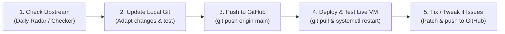

# AzamGNS3 Single-VM Upstream Sync & Operations Plan

*Target Environment: 1 Live Ubuntu 26 VM* | *Repository: azambasha1987/MyRepo (AzamGNS3)*

---

## 1. The Strategy: Simple 5-Step Loop

Since we operate **one single live VM** and want zero redundant work or SDLC overhead, our strategy is straightforward:



1. **Check Upstream Code**: Run update checker to inspect new commits from official GNS3 repos (`gns3-server`, `gns3-gui`, `gns3-web-ui`).
2. **Update Local Git**: Adapt safe fixes into local Git, ensuring custom performance code isn't overwritten, and run unit tests.
3. **Update GitHub**: Push vetted code directly to GitHub (`git push origin main`).
4. **Test Live VM**: Pull on the live VM (`git pull origin main`) and restart service (`sudo systemctl restart azamgns3`).
5. **Fix & Update**: If any glitch occurs on the live VM, fix it locally, push to GitHub, and pull on the VM.

---

## 2. Core Protection Rule: What NOT to Overwrite

When upstream commits arrive, update everything **except** AzamGNS3's core performance engines:

| Protected Component | Location | Why It Must Be Preserved |
| :--- | :--- | :--- |
| **Lossless CPU Governor** | `gns3server/compute/qemu/cpu_governor.py` | Uses cgroups v2 `cpu.weight`. Never allow upstream `cpulimit` (`SIGSTOP`/`SIGCONT`) which flaps BGP/OSPF. |
| **High-Performance QEMU Flags** | `gns3server/compute/qemu/qemu_vm.py` | Must preserve `aio=io_uring`, `cache=none`, `vhost=on`, and `virtio-balloon-pci`. |
| **Anti-Bootstorm Scheduler** | `gns3server/controller/bootstorm.py`<br>`gns3server/controller/project.py` | Must preserve weighted staggered node boot (`start_all` hook). |
| **Python 3.14 Hotfixes** | `gns3server/controller/compute.py`<br>`gns3server/controller/__init__.py` | Must preserve explicit `import aiohttp.web`. |

---

## 3. Step-by-Step Operator Runbook

### Step 1: Check Upstream Code
Check if official GNS3 has pushed new commits or release tags:

```bash
# On your local machine (Windows or Linux):
python scripts/azamgns3-update-checker.py --generate-patches
```
* **🟢 SAFE**: Commits touch only non-critical files (appliances, schemas, documentation, UI styling).
* **🔴 COLLISION**: Commits touch our protected performance symbols. Check the generated diff in `docs/reports/patches/`.

---

### Step 2: Update Local Git After Checks
If upstream has safe improvements, bug fixes, or new features you want:

1. **Review and port the changes** into your local working tree.
2. **Run the pre-flight verification probe**:
   ```bash
   python tests/test_optimizations.py
   ```
3. **Mark synced & commit locally**:
   ```bash
   python scripts/azamgns3-update-checker.py --mark-synced
   git add .
   git commit -m "sync: adapt upstream updates and preserve AzamGNS3 optimizations"
   ```

---

### Step 3: Update GitHub
Push your verified code directly to your GitHub repository:

```bash
git push origin main
```

---

### Step 4: Deploy & Test on Live VM
SSH into your live Ubuntu 26 VM and update:

```bash
cd /opt/azamgns3
git pull origin main
sudo systemctl restart azamgns3
```

#### Live Verification Checklist:
* Open the Web UI: `http://<vm-ip>:3080/`
* Start a heavy node (e.g., Cisco C8000v / Arista vEOS) and verify it boots smoothly.
* Verify QEMU options in process list:
  ```bash
  ps aux | grep qemu-system | grep io_uring
  ```
  *(Should output `aio=io_uring,cache=none` and `vhost=on`)*.

---

### Step 5: Fix Issues (If Any) & Rollback Runbook

#### If a minor issue is observed on the Live VM:
1. Fix the code on your local development machine.
2. Run `python tests/test_optimizations.py`.
3. Commit and push:
   ```bash
   git add .
   git commit -m "fix: resolve live VM issue"
   git push origin main
   ```
4. On the live VM, re-pull and restart:
   ```bash
   cd /opt/azamgns3 && git pull origin main && sudo systemctl restart azamgns3
   ```

#### Instant 1-Command Rollback (If critical):
If something goes wrong and you need an instant revert on the live VM:
```bash
cd /opt/azamgns3
git reset --hard HEAD~1
sudo systemctl restart azamgns3
```
Running nodes and active topologies stay safe because QEMU process state is decoupled from the controller daemon.

---

## 4. Daily Automated Monitor (Hands-Off Daily Check)

To ensure you don't even have to remember to check manually:
* **GitHub Actions** runs daily at **02:00 UTC (07:30 IST)** ([`.github/workflows/azamgns3-upstream-sync.yml`](file:///e:/Git/AzamGNS3/.github/workflows/azamgns3-upstream-sync.yml)).
* You can check the GitHub Actions tab anytime to see if any upstream commits or new tags were flagged.
* On Windows, double-click [`scripts/check-upstream-daily.bat`](file:///e:/Git/AzamGNS3/scripts/check-upstream-daily.bat) to scan whenever you sit down to work.
