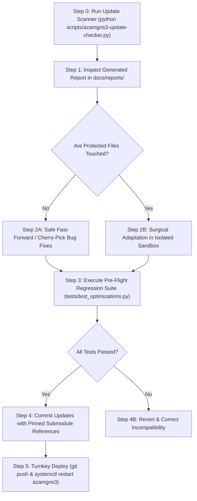

# Update Check & Code Cross-Audit Plan (AzamGNS3)

*Scan Platform: Ubuntu 26.04 (Resolute) / Windows 11* | *Repository: azambasha1987/MyRepo (AzamGNS3)*

---

## 1. Mandatory Safeguards: The Zero-Glitch Protocol

> [!CAUTION]
> ### NON-REGRESSION DIRECTIVE
> All actions, code reviews, and upstream integrations must strictly follow the **AzamGNS3 Zero-Glitch Protocol**:
> 1. **Zero Disruption to Active Labs & Running Nodes**:
>    - Never execute blanket service restarts or network reloads during active lab execution.
> 2. **Automated Rollback Checkpoints (`.bak.<timestamp>`)**:
>    - Every production file must have an immutable, timestamped backup created prior to mutation, backed by an instant rollback procedure.
> 3. **Preservation of Performance Engines**:
>    - **Lossless CPU Governor (`cpu.weight`)**: Cgroups v2 dynamic scheduling and 5s hysteresis must never be replaced by legacy `cpulimit`.
>    - **Anti-Bootstorm Scheduler**: Weighted node startup tiers and load gating in `project.py` must never be overwritten.
>    - **Direct I/O (`io_uring`) & TAP `vhost=on`**: Asynchronous storage DMA and kernel TAP acceleration in `qemu_vm.py` must remain intact.
>    - **VirtIO Memory Ballooning**: Dynamic RAM reclamation for KSM memory deduplication must be preserved.
> 4. **Pre-Flight Syntax & Sanity Probes**:
>    - Every script is verified with `py_compile`, and all unit tests in `tests/test_optimizations.py` must pass with zero failures before committing.

---

## 2. Core Philosophy: Audited Adaptation vs. Blind Copy-Pasting

> [!IMPORTANT]
> ### WHY WE DO NOT BLINDLY MERGE UPSTREAM COMMITS
> Official upstream GNS3 repositories frequently push commits that:
> - Re-introduce external `cpulimit` (which uses `SIGSTOP`/`SIGCONT` that drops packets and flaps BGP/OSPF).
> - Remove or alter QEMU disk options, wiping `aio=io_uring` and `cache=none`.
> - Omit `-device virtio-balloon-pci`, defeating host KSM deduplication.
> - Introduce Python 3.14 import errors (such as `AttributeError: module aiohttp has no attribute web`).
> - Revert web UI console configurations or force desktop GUI dependencies.
> 
> Therefore, AzamGNS3 operates a **curated, human-in-the-loop intelligence, audit, and adaptation pipeline**:
> 1. **Upstream Drift Radar**: Automatically detect new commits across `gns3-server`, `gns3-gui`, and `gns3-web-ui`.
> 2. **Surgical Code Cross-Audit**: Compare incoming diffs against our protected touchpoints.
> 3. **Audited Adaptation**: Port only safe upstream bug fixes and security patches into AzamGNS3 while keeping our performance core 100% protected.

---

## 3. Protected Touchpoints Matrix (AzamGNS3 Shield)

| Protected File | Description | Collision Action |
| :--- | :--- | :--- |
| [`gns3server/compute/qemu/cpu_governor.py`](file:///e:/Git/AzamGNS3/gns3-server/gns3server/compute/qemu/cpu_governor.py) | Cgroups v2 dynamic CFS weight scheduling | **IMMUNE**: Never overwrite with upstream code. |
| [`gns3server/compute/qemu/qemu_vm.py`](file:///e:/Git/AzamGNS3/gns3-server/gns3server/compute/qemu/qemu_vm.py) | Direct `io_uring` I/O, `vhost=on`, `virtio-balloon`, and `CpuGovernor` hooks | **HIGH CAUTION**: Audit line-by-line before adapting. |
| [`gns3server/controller/bootstorm.py`](file:///e:/Git/AzamGNS3/gns3-server/gns3server/controller/bootstorm.py) | Anti-Bootstorm weighted startup engine | **IMMUNE**: Never overwrite with upstream code. |
| [`gns3server/controller/project.py`](file:///e:/Git/AzamGNS3/gns3-server/gns3server/controller/project.py) | `start_all()` hook into `BootstormEngine` | **CAUTION**: Preserve `BootstormEngine.start_nodes_staggered`. |
| [`gns3server/controller/compute.py`](file:///e:/Git/AzamGNS3/gns3-server/gns3server/controller/compute.py) | Python 3.14 explicit `aiohttp.web` import | **CAUTION**: Preserve `import aiohttp.web`. |
| [`gns3server/controller/__init__.py`](file:///e:/Git/AzamGNS3/gns3-server/gns3server/controller/__init__.py) | Python 3.14 explicit `aiohttp.web` import | **CAUTION**: Preserve `import aiohttp.web`. |

---

## 4. Standard Operating Procedure: The 5-Step Update Workflow



### Step 0: Run the Live Scanner
```bash
# From workspace root
python scripts/azamgns3-update-checker.py
```

### Step 1: Review the Markdown Audit Report
The scanner generates a timestamped report under [`docs/reports/`](file:///e:/Git/AzamGNS3/docs/reports/):
- Review the commit breakdown table.
- Verify risk tags (🟢 SAFE vs. 🟡 CAUTION vs. 🔴 COLLISION).

### Step 2: Surgical Adaptation
- For non-conflicting commits: cherry-pick or fast-forward clean submodules.
- For conflicting commits touching `qemu_vm.py` or `project.py`: manually review the git diff (`git diff HEAD origin/master path/to/file`) and merge only the relevant bug fix without touching our optimization hooks.

### Step 3: Run Pre-Flight Health Probes
```bash
# Run unit tests
python tests/test_optimizations.py

# Verify Python AST compilation
python -m py_compile gns3-server/gns3server/compute/qemu/cpu_governor.py
python -m py_compile gns3-server/gns3server/controller/bootstorm.py
python -m py_compile gns3-server/gns3server/compute/qemu/qemu_vm.py
```

### Step 4: Commit & Push
```bash
git add gns3-server docs/reports
git commit -m "sync(upstream): adapt upstream bug fixes while preserving AzamGNS3 performance core"
git push origin main
```
