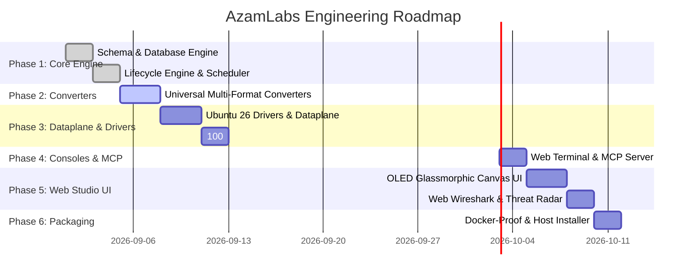
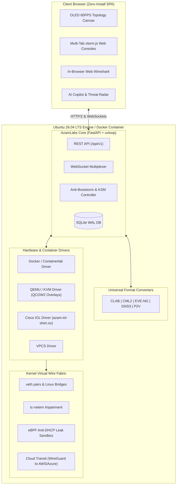

# 🏗️ AzamLabs: Phased Roadmap & Architecture Blueprint

This document outlines the phased engineering roadmap and technical architecture of **AzamLabs**, designed to be crystal-clear for non-developer vibe-coders and technical architects alike.

---

## 🗺️ The 6-Phase Implementation Roadmap

### Phase 1: Core Engine, Data Schema & Database
- Canonical universal graph schema (`AzamTopology`, `AzamNode`, `AzamInterface`, `AzamLink`, `AzamNetwork`).
- Async SQLite database engine with WAL (Write-Ahead Logging) mode.
- Lab lifecycle coordinator (start, stop, wipe, restart, status).
- Anti-bootstorm staggered startup scheduler & CPU eco-mode.

### Phase 2: Universal Multi-Platform Converters
- **Containerlab Converter**: bidirectional support for `*.clab.yml` / `*.clab.yaml`.
- **Cisco Modeling Labs (CML 2.x) Converter**: bidirectional support for CML `*.yaml`.
- **EVE-NG / PNETLab Converter**: bidirectional support for XML `*.unl`.
- **GNS3 Converter**: bidirectional support for JSON `*.gns3`.
- **P2V Config Importer**: converts Cisco/Arista `show running-config` text into a virtual lab.
- **Universal Importer**: auto-detects uploaded file format and renders the topology immediately.

### Phase 3: Pluggable Drivers & Virtual Dataplane (Ubuntu 26 Native)
- Containerlab/Docker driver managing containers, veth pairs, and Linux network namespaces.
- QEMU/KVM driver with instant QCOW2 copy-on-write overlays.
- Cisco IOL driver with custom `azam-iol-shim.so` (100:1 CPU/RAM consolidation).
- eBPF/nftables anti-DHCP leak sandbox to protect physical home/office networks.
- Wire-level traffic impairment (`tc-netem`) and live packet capture (`tcpdump`).
- Cyber Range attack simulation engine (SYN floods, ARP poisoning, port scans).

### Phase 4: Consoles, Web Terminal & Model Context Protocol (MCP)
- Multi-protocol console gateway: WebSocket-to-Telnet, SSH, and PTY bridging.
- Flow-controlled bulk configuration paster (prevents dropped lines).
- Native URI scheme generation (`telnet://<host>:<port>`).
- Built-in Model Context Protocol (MCP) server for external AI tools (Claude, Gemini).

### Phase 5: High-Performance Futuristic Web Studio (Frontend)
- Cyber-tactical OLED Pure Dark glassmorphism (`#070a13` space background, frosted glass panels).
- GPU-accelerated 60 FPS HTML5 Canvas with animated photon particle flows.
- Multi-tab xterm.js terminal drawer with dock/minimize controls.
- In-browser Web Wireshark packet analyzer with live decode tree.
- Command Palette (`Ctrl+K`) for rapid keyboard navigation.
- Real-time multi-user collaborative presence with live colored cursors.

### Phase 6: CLI Utility, Docker-Proof Packaging & Ubuntu 26 Host Setup
- High-velocity standalone CLI tool (`azam`).
- Multi-stage production `Dockerfile` (<150MB) and `docker-compose.yml`.
- Native single-line host installer script (`install-azamlabs.sh`) for Ubuntu 26.04 servers.
- Automated end-to-end test suite verifying converters, lifecycle, and WebSockets.

---

## 🏛️ System Architecture Diagram

---

## 🛠️ Technology Stack Breakdown

| Layer | Chosen Technology | Why It Was Chosen |
| :--- | :--- | :--- |
| **Operating System** | **Ubuntu 26.04 LTS ("Resolute")** | Linux kernel 6.x/7.x, native cgroups-v2, Netplan v2, systemd-networkd, KVM virtualization. |
| **Backend Framework** | **Python 3.12+ FastAPI + Starlette** | Asynchronous non-blocking I/O, automatic OpenAPI docs, modular driver architecture. |
| **Async Event Loop** | **uvloop (C-based libuv)** | Speeds up Python asyncio by 2–4x, matching Go and Node.js throughput. |
| **Database** | **Embedded SQLite WAL + aiosqlite** | Zero memory daemon overhead; replaces heavy MySQL server, saving ~400MB RAM. |
| **Consoles** | **xterm.js + WebSockets + PTY** | Sub-millisecond browser terminal latency; supports Telnet, SSH, Serial, and VNC. |
| **Frontend UI** | **Vanilla ES6+ + HTML5 Canvas/SVG** | Ultra-lightweight, 60 FPS GPU-accelerated rendering, <200ms load time, zero bundle bloat. |
| **Virtual Dataplane** | **Linux Bridges, veth & tc-netem** | Zero-copy kernel networking with microsecond forwarding latency and accurate traffic shaping. |
| **Container Engine** | **aiodocker / Docker SDK** | Non-blocking container orchestration directly over Docker daemon socket. |
